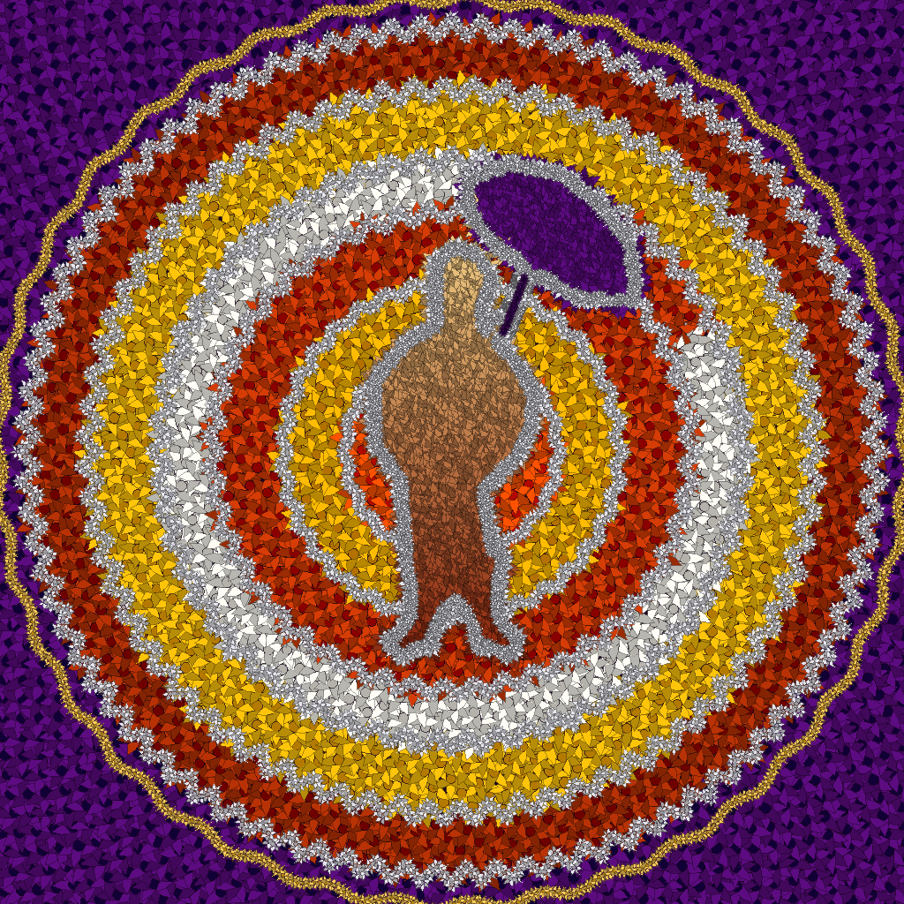

# Code-a-Pookalam


A procedural Onam pookalam (traditional Kerala flower arrangement) generated
entirely in Python — no image editor, no manual placement. Flower positions
come from golden-angle phyllotaxis (the same spiral packing rule sunflower
seeds follow), colour-zoned radially outward, with a traced silhouette of
King Mahabali (Maveli) and his Olakuda umbrella built *from* the same flower
field rather than pasted on top as flat colour.

## How it works
 
- **Placement:** `θ = n × 137.508°`, `r = c√n` — the golden-angle spiral,
  generated once and reused for every flower on the canvas.
- **Colour:** radius from center maps to a concentric zone (cream → gold →
  orange → white → orange → gold → orange → purple), each zone rendered as
  layered, multi-petal flower sprites.
- **The figure:** Maveli + umbrella is a hand-traced SVG silhouette
  (`maveli_poly.npy`), rasterized and blended into the same colour field —
  his region inherits and brightens the underlying ring colour instead of
  sitting on top as a solid shape.
## Run it
 
```
pip install -r requirements.txt
python pookalam.py
```
 
If `pip`/`python` aren't recognized: try `pip3`/`python3` (Mac/Linux) or
`py -m pip`/`py` (Windows).
 
`maveli_poly.npy` must be in the same folder as `pookalam.py` — the script
loads it at runtime to build the silhouette. Output is `pookalam_1024.png`
(1024×1024), saved to the same directory.
 
## Stack
 
Python · Pillow (PIL) · NumPy · SciPy · Matplotlib (`matplotlib.path` for
polygon containment)
 
## License
 
MIT — see [LICENSE](./LICENSE).
 
